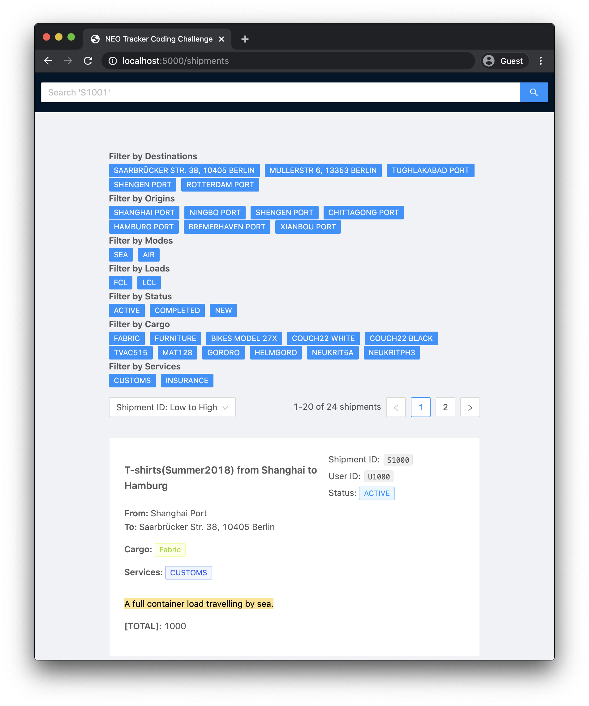

# Shipment Tracker



## Table of Contents

- [About](#about)
- [Getting Started](#getting_started)
- [Use Cases](#use_cases)

## About <a name = "about"></a>

This repository is meant to be an example of a quickly developed front end using [React](https://reactjs.org/) and [TypeScript](https://www.typescriptlang.org/). A number of tradeoffs are discussed in the [Use Cases](#use_cases) section to keep the development scoped to the front end.

## Getting Started <a name = "getting_started"></a>

To get this project started on your local machine:

1. In the root folder of the project, run:

```bash
yarn install
```

3. Start the json server by running:

```bash
yarn server
```

4. In another terminal window, build the app and deploy it on your local machine by running

```bash
yarn deploy
```

### Prerequisites

If you do not already have `serve` installed globally, you will need to install it before running the project. Do so by running:

```bash
  yarn global add serve
```

## Use Cases <a name = "use_cases"></a>

We define a number of use cases to guide development. The user should be able to:

- See shipments in pages of 20 elements per page

  - In `src/sections/Shipments/index.tsx` I used a constant `PAGE_SIZE` set to `20`. I used the `useState` hook to keep track of the current page number and the subarray of shipments to show. In a production setting, this logic should be implemented on the server side, were it not already provided. `json-server` also implements pagination.

- Search by shipment id

- Sort by different fields (e.g. id, name) in ascending/descending order

- Tests written for functions used to sort and filter shipments

- Be able to filter shipments by different criteria, like destination, cargo, etc. (open-ended)

  - In `src/sections/Shipments/index.tsx` I used functions defined in `src/lib/util` to filter, order, and search the shipments by id. In a production setting, it would also make sense to move this logic to the server, and use `react-query` to cache results of identical calls to the API. While `json-server` does implement some of this functionality, I moved this logic to the client code to fulfill the testing requirement.

- View the shipment information on a separate shipment details page

  - Each shipment card is wrapped in a `Link` component linking to the `shipment/:id` route, with the shipment's id passed in as a parameter.

- Update the shipment name (should persist when the page is reloaded)

  - I used the `useMutation` hook from `react-query` here to send a patch request with new information to the API.

- The interactions should not refresh the page
